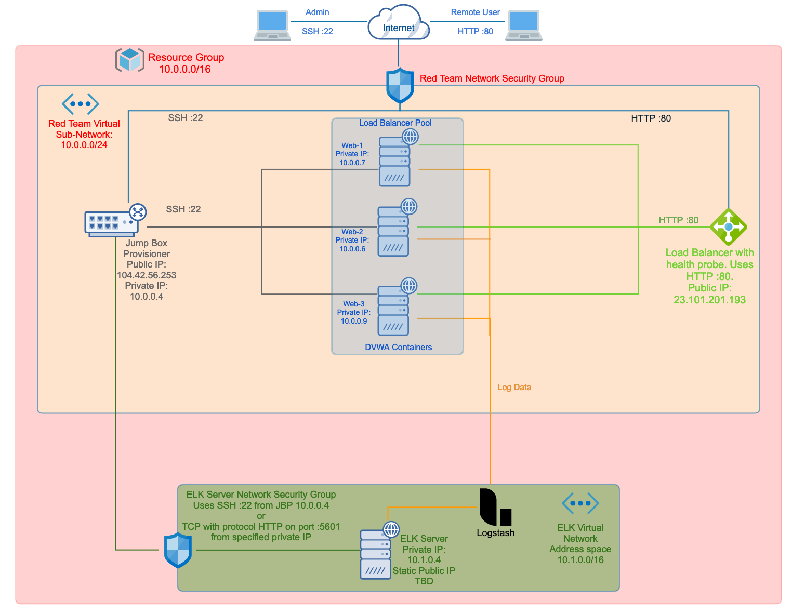
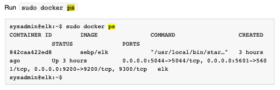

# Guys-Repo
Repository for all things created or otherwise handled by Steve Guy

## Automated ELK Stack Deployment

The files in this repository were used to configure the network depicted below.

These files have been tested and used to generate a live ELK deployment on Azure. They can be used to recreate the entire deployment pictured above. Or alternatively, select portions of the Ansible file may be used to install individual components, such as Filebeat.

  - [Ansible folder](P1Images/Ansible)

This document contains the following details:

	* Description of the Topology
	* Access Policies
	* ELK Configuration
  		* Beats in Use
  		* Machines Being Monitored
	* How to Use the Ansible Build

## Description of the Topology

The main purpose of this network is to expose a load-balanced and monitored instance of DVWA, the Damn Vulnerable Web Application.

Load balancing ensures that the application will be highly available, in addition to restricting access to the network. Using a load balancer enables access via HTTP to different VM's present on the network. The use of a jump box provisioner enables SSH access for system mainenance and administrative functions.

Integrating an ELK server allows users to easily monitor the vulnerable VMs for changes to the data and system logs. The installation and proper configuration of Filebeat provides monitoring of the log files or other locations that the administrator specifies. It also collects log events and forwards them to either Elasticsearch or Logstash for indexing. The installation of Metricbeat provides for the collection of metrics from the operating system and from other services running on the server. Metricbeat, like Filebeat, sends the output to either Elasticsearch or Logstash.

The configuration details of each machine may be found below.

| Name     | Function | IP Address | Operating System |
|----------|----------|------------|------------------|
| Jump Box | Gateway  | 10.0.0.4   | Linux            |
| Web-1    |Web Server| 10.0.0.7   | Linux            |
| Web-2    |Web Server| 10.0.0.6   | Linux            |
| Web-3    |Web Server| 10.0.0.9   | Linux            |
| ELK-Server|Monitoring|10.1.0.4|Linux

## Access Policies

The machines on the internal network are not exposed to the public Internet. 

Only the Ret Team Security Group can accept connections from the Internet. Access to this machine is only allowed from 97.126.51.129, the dynamic IP address as of the writing of this document. The SSH connections are routed to the jump box provisioner while the HTTP connections go to the load balancer.

Machines within the network can only be accessed directly by the jump box provisioner via SSH on 104.42.56.253 port 22. Traffic to the load balancer comes in through its public IP address, 23.101.201.193. From there the traffic is sent to the backend pool servers as listed above.

The ELK server is accessible only from the jump box provision. Setting it up in that fashion prevents any connection from the public IP load balancer.

A summary of the access policies in place can be found in the table below. Note that the load balancer 

| Name         | Publicly Accessible | Allowed IP Addresses |
|--------------|---------------------|----------------------|
| Jump Box     |     No - SSH :22    | 10.0.0.4 on port 22         |
| Load Balancer|    Yes - HTTP :80   | 97.126.51.129 on port 80       |
| Web-1        |     Not directly   | SSH from 10.0.0.4 or HTTP from 23.101.201.193 |
| Web-2        |     Not directly   | SSH from 10.0.0.4 or HTTP from 23.101.201.193 |
| Web-3        |     Not directly   | SSH from 10.0.0.4 or HTTP from 23.101.201.193 |
| ELK Server | No - SSH :22 or HTTP :5601| SSH from 10.0.0.4 or HTTP from load balancer pool|

##Elk Configuration

Ansible was used to automate configuration of the ELK machine. No configuration was performed manually, which is advantageous because deploying Docker containers via Ansible allows for significant automation of the deployement process. Not only does that provide for less configuration labor but it allows for rapid scalability to accomodate changing needs.

The playbook implements the following tasks:
	
	* Install docker.io (including update_cache to permit installation)
	* Install python3-pip
	* Install Python Docker Module by the pip module so that Ansible can control the Docker containers.
	* Download and install the desired Docker web container on the specified port
	* Specifies restart of the of the container each time that that the machine is restarted (avoids the need to manually restart the container each time that it is used)

The following screenshot displays the result of running `docker ps` after successfully configuring the ELK instance.

## Target Machines & Beats
This ELK server is configured to monitor the following machines:

* Web-1 at 10.0.0.7
* Web-2 at 10.0.0.6
* Web-3 at 10.0.0.9

We have installed the following Beats on these machines:

* Metricbeat
* Filebeat 

These Beats allow us to collect the following information from each machine:

* Metricbeat periodically collects metrics from the OS and services running on the server. It then sends the output to Logstash for indexing.
* Filebeat monitors log files or specified locations. It then collects logged events and sends the output to Logstash for indexing.

## Using the Playbook
In order to use the playbook, you will need to have an Ansible control node already configured. Assuming you have such a control node provisioned: 

SSH into the control node and follow the steps below:
- Copy the configuration file from your Ansible container to system to be imaged.
- Update the etc/ansible/hosts file to include the IP addresses of the ELK server and the webservers.
- Run the playbook, and navigate to http://[elk_vm_public_ip]:5601/app/kibana to check that the installation worked as expected.

The file for Metricbeat is metricbeat-playbook.yml and the file for Filebeat is filebeat-playbook.yml. They are copied into their own /etc/ansible/files/ directories respecively. 

The filebeat-config.yml and metricbeat-config.yml files each need to be updated to allow Ansible to run on the machine. 

Updating of the host files with the IP addresses of the web serves and ELK server will allow you to specify to which system the specific Ansible files will be sent.
